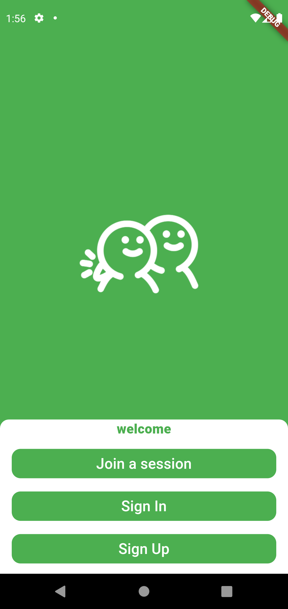
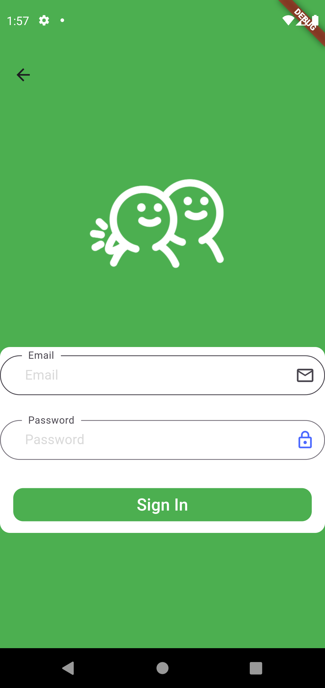
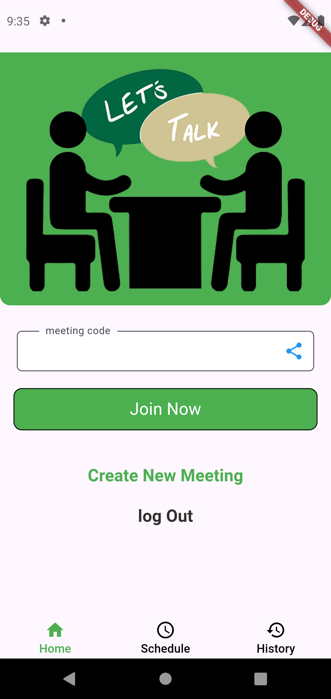
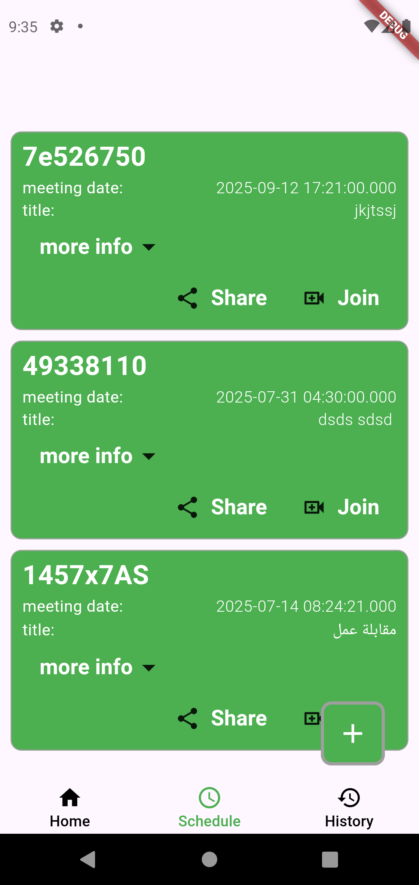
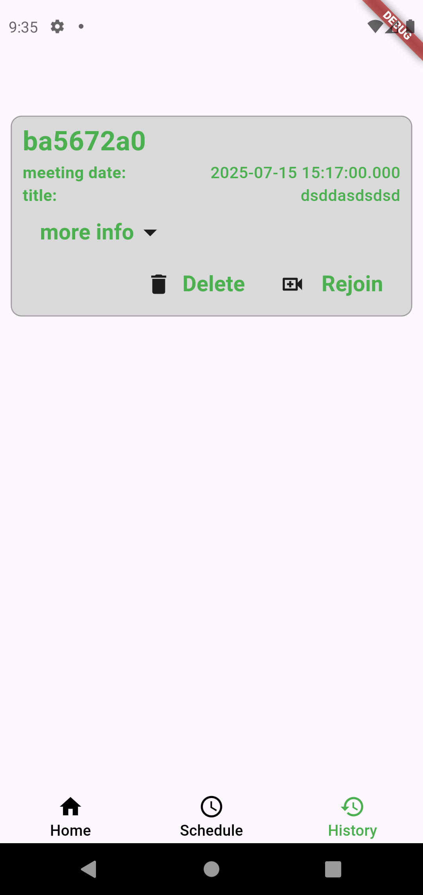
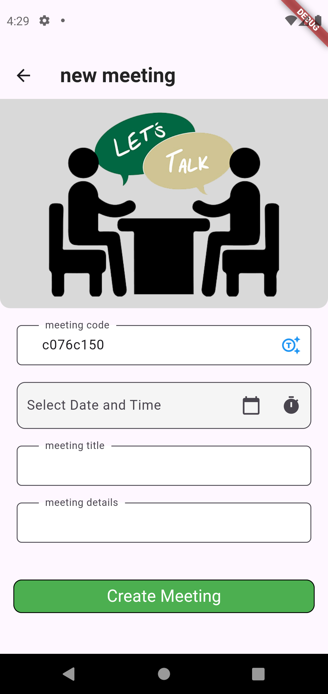
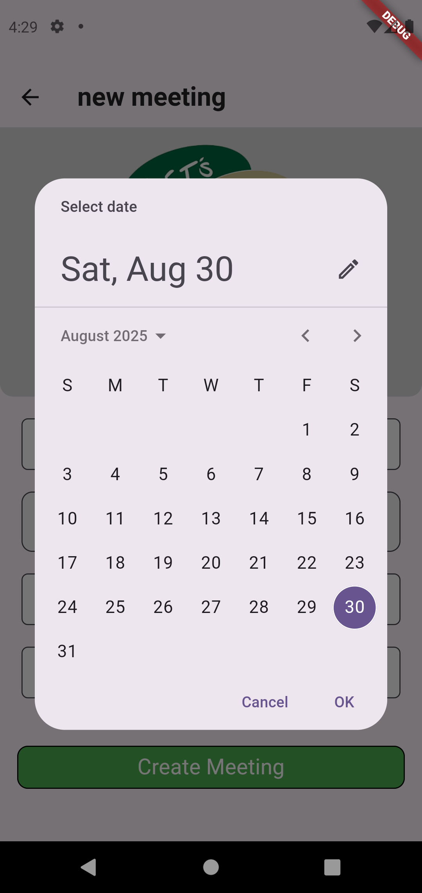

# Meeting App
### This application provides a comprehensive and user-friendly platform for video conferencing, built to facilitate seamless communication and collaboration. The key features include:
## Features

### Secure User Authentication: 

-Create and manage your account with a secure authentication system, allowing you to sign in and access your personal meeting data.
 
### Effortless Meeting Creation:

-  Instantly create new meeting rooms with a single tap. The app generates a unique meeting ID, making it easy to share with others.

### Join Any Meeting:

- Seamlessly join existing meetings by simply entering the unique meeting ID provided by the host.
### Meeting History:

- Never lose track of your past conversations. The app keeps a detailed history of all your meetings, allowing you to revisit meeting information at any time.
 ### Schedule Meetings:

- Plan for the future by scheduling meetings in advance. You can set the date and time, and the app will organize your upcoming meetings for you.

### Powered by Jitsi:

-At its core, the video conferencing functionality is powered by the robust and reliable Jitsi platform, ensuring high-quality audio and video for all your calls.

## Screenshots

<table>
  <tr>
    <td></td>
     <td></td>
    
  </tr>
 <tr>
  <td></td>
    <td></td>
   
  </tr>
   <tr>
    <td></td>
  
  </tr>
   <tr>
    <td></td>
   <td></td>
  </tr>

  </table>
